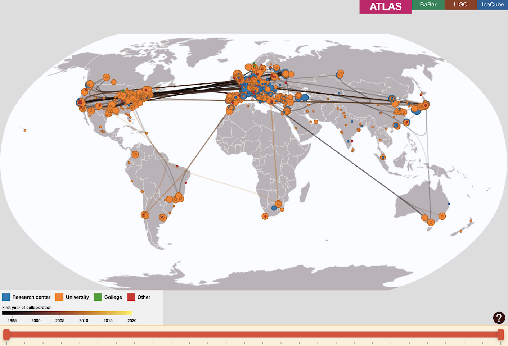
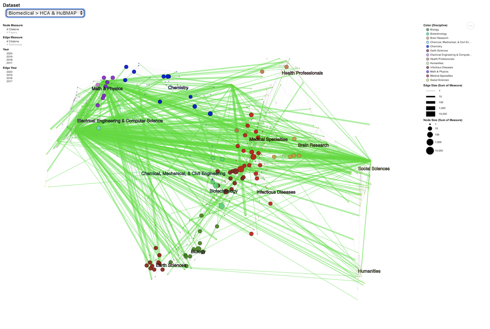

## Welcome to the *Visualizing big science projects* companion page

This website accompanies the Nature Reviews Physics Perspective on "Visualizing big science projects". The interactive visualizations can be accessed from the links below:

|  |  |
|:--:| :--: |
| [*Institutions Collaborations Maps*](https://bigscience.github.io/institutionsmaps/) | [Science Maps](https://bigscience.github.io/sciencemaps/) |
| [https://bigscience.github.io/institutionsmaps/](https://bigscience.github.io/institutionsmaps/) | [https://bigscience.github.io/sciencemaps/](https://bigscience.github.io/sciencemaps/) |

### Data and Code is available at:
- [https://bigscience.github.io/bigscience/](https://bigscience.github.io/bigscience/)

### Static maps for the institution collaboration networks:

|  |
| :----------------------------------------: |
|   [Static Institution Collaboration Maps](<https://bigscience.github.io/Institution Maps All Projects.pdf>)    |
